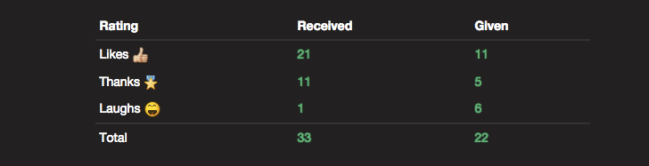
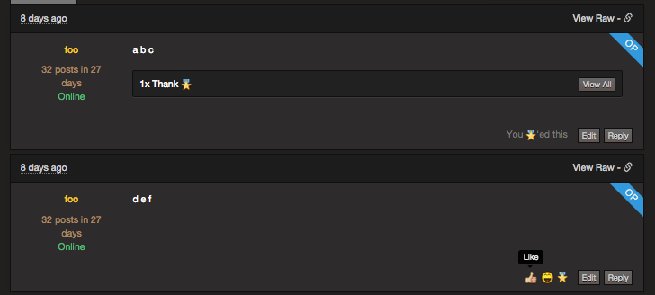
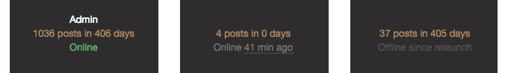
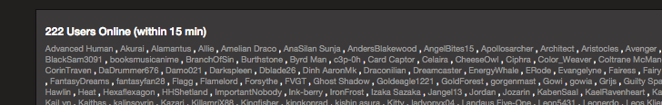
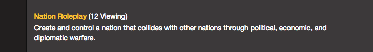
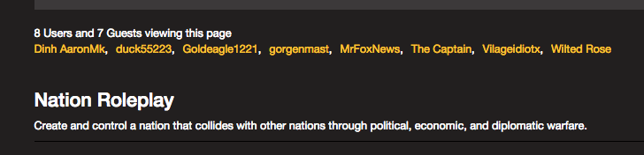
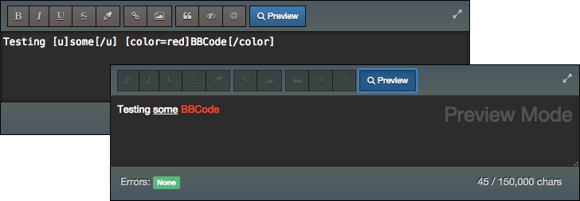

# Guild

Work in progress

## Features

### Post Ratings

Users can express appreciation for posts they liked, laughed at, found helpful, etc. without having to write a post. They just click the rating button. By reducing the barrier to this kind of feedback, more people are willing to provide it.

### User last-online-at tracking

Users are considered "online" if they've visited the forum within 15 minutes.

When a user is offline, the forum shows when they were online last.

Users that want more privacy can enable "Ghost Mode" which hides the last-online-at field on their posts and remove them from the "Who's Online" list.

### Viewer tracking

The forum tracks the visitors that are viewing each page and then presents this info to all visitors. It makes the forum feel more alive and gives users a feel for the "regulars" of the subforums they frequent.

Logged-in users that have "Ghost Mode" enabled and unauthenticated visitors are considered guests.

### BBCode editor + preview

The BBCode editor, the preview button, and the BBCode error output are implemented with patched versions of the [Bootstrap Markdown](https://github.com/toopay/bootstrap-markdown) and [Extendible-BBCode-Parser](https://github.com/danneu/Extendible-BBCode-Parser) libraries.

## Setup and Install

The Guild is a Node.js app (v0.11.x) that talks to a Postgres database.

- You'll specifically need the latest version of Node v0.11.x (unstable) for your system: http://blog.nodejs.org/2014/09/24/node-v0-11-14-unstable/. The Guild won't run on Node v0.10.x (stable).

- The Guild depends on the `plv8` Postgres extension.

- Download the repository and enter the directory that it created:

        git clone git@github.com:danneu/guild.git
        cd guild

- Enter the `guild` directory and install its dependencies:

        npm install

- Launch Postgres (by default it will run on `http://localhost:5432`) and create an empty database named `guild`.

        createdb guild

- The Guild comes with a command that rebuilds the database with tables and fills them with some data to play with:

        npm run-script reset-db

- Now you can launch the server:

        npm start
        > Listening on http://localhost:3000

## Config and Environment Variables

The Guild is configured with environment variable listed in [server/config.js](https://github.com/danneu/guild/blob/master/server/config.js).

It will run with the default variables, but some features are turned off until they are configured:

- Email-sending system requires `AWS_KEY` and `AWS_SECRET` (your http://aws.amazon.com/ API creds)
- User registration system requires `RECAPTCHA_SITEKEY` and `RECAPTCHA_SITESECRET` (your https://www.google.com/recaptcha/intro/index.html API creds)

## TODO

- Add tests for authorization abstraction
- Create `docs/bulk_updates.sql`
- Add online-status to post user-meta for mobile-sized devices
- Fix slow BBCode tags like [tabs] so that I can possibly render BBCode on the fly instead of pre-baking it in the `html` columns
- Finish BBCode support in convos
- Create cronjob (Heroku Scheduler) for db.clearExpiredViews
